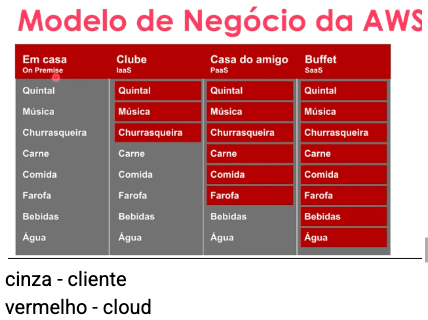

# **AWS DIO DESAFIO MÓDULO 2**

# AWS VISÃO GERAL
**Cloud OPEX** não necessita de grande infrastructure para iniciar projeto

 
**Modelo CAPEX** precisa de infrastructure fisica para iniciar projeto  
-> **Variedade de Servicos:** Desde computacao, armazenamento e banco de dados ate servicos especializados como machine learning, loT e analise de dados.

**Modelos de serviços**

**SaaS** ou Software as a service - Software como servico (pago pelo uso como email, streaming etc) 
**USE**  
→ pago pelo uso

**PaaS** - Plataform as a Service (desenvolvimento de aplicacao, streaming web decisoes de suporte) 
**CONSTRUA**  
→ vou pegar minha solução e implantar e.g. SQL server (só faco deploy)

**IaaS ou Infrastructure as a service** - Infra como servico (Sistema Legado, Servidor de Arquivos
Segurança, Sistema de gerenciamento,Sistema de cache) **MIGRE**
→ vou construar do zero 

**Nivel de controle e responsabilidade**

**SaaS** - Software como serviço
O **cliente** apenas USA o software (ex: Gmail, Office 365

**PaaS** - Plataforma como serviço
O cliente **CONSTRÓI** e implanta sua aplicação sobre a plataforma gerenciada pelo provedor.
**hibrido - cloud e cliente**

**IaaS** - Infraestrutura como serviço
Ideal para **MIGRAR** sistemas legados (tecnologias mais antigas) para a nuvem, oferecendo controle total sobre servidores e armazenamento.

A **AWS** se destaca não apenas pela sua **infraestrutura global robusta**, mas também pela capacidade de **inovação** constante e **adaptação às necessidade**s do mercado.
Isso a torna uma escolha preferida para empresas de todos os tamanhos e setores

**Aumentando recursos** - Amazon Web Services

1 de TI, usando a capacidade da nuvem Migrando aplicativos

2 existentes e dados para a nuvem

3 Construindo novos aplicativos, sites, serviços e linhas de negócios

## **Formação AWS Cloud Foundation**

**regions** (regioes) infraestrutura fisica

Cada região (region) é projetada para ser isolada das outras regiões. Isso proporciona a maior tolerância a falhas e estabilidade possível.
Composta por 2 ou mais zonas disponibilidade.

**→ DATAS CENTERS** (não sabemos onde fica, sabemos apenas a região)

**Regions**: areas geográficas contendo availability zones
**Availability zones**: data centers independentes fisicamente mas conectado logicamente garantindo disponibilidade.

**Pontos a levar em consideração, quando for escolher uma região:**

> Compliance  
> Disponibilidade de Serviços  
> Custo   
> Latência 

**PRATICAS DE SEGURANÇA**

Criar conta root e depois guardar
Não compartilhar dados da conta
Ficar a tento ao email com as cobranças
Autenticação multifator (MFA)
Estabelecer barreiras de proteção para permissões

**Como posso criar meus recursos na AWS?**

Via portal   
AWS SDK    
CloudShell

**IAM (core)**
Identity access management  
→ to manage access to people

How to access resources on AWS
Console AWS - 
**CloudShell** - linhas de comando, baseado em recursos mais comuns (python)  
**AWS CLI** - terminal para interagir acessando as contas

**Controle de Gastos e alertas**

no console ir até gerenciamentos cobranças e custos
configurar orçamento e orçamento de gasto zero
incluir email para receber alerta
Definir se a recorrencia do alerta
Inserir valor orçado
Criar em proximo
Revisar 

_**Importante atualizar contato de faturamento**_

**Módulo 2: Computação na Nuvem em EC2**

Instâncias EC2 cabe no IaaS

EC2 — Elastic Compute Cloud, são as máquinas virtuais na AWS, podendo ser com sistema operacional Windows ou Linux.

Uma EC2 é composta por:

CPU    
Memória    
Rede    
Disco   
Sistema Operacional 
                                     		

Como escolher a EC2 correta pra minha aplicação?  
**→** é crucial saber escolher de forma inteligente a instancia correta na AWS para garantir eficiencia, escalabilidade e economia.

Como usar cada tipo de Instância EC2 

**Uso Geral** (General Purpose)
Como o sistema de gestão de uma clínica médica - faz um pouco de tudo: agenda consultas, cadastra pacientes, emite receitas, controla estoque. Não é especializado em uma coisa só, mas resolve a maioria das necessidades do dia a dia.

**A1**: Site WordPress de uma loja pequena (20-50 visitantes por dia)
API simples para app mobile básico,
Servidor de email interno da empresa,
Sistema de chat interno com poucos usuários

**T2**: Site institucional de escritório de advocacia, Blog corporativo com 200 visitas/dia,
Sistema de agendamento de consultas,
Banco de dados MySQL pequeno (cadastro de clientes)

**M4**: E-commerce médio (Magento, WooCommerce),
Sistema ERP de empresa com 100-500 funcionários,
API que serve app mobile com milhares de usuários,
Servidor web principal da empresa

**Otimizadas para Processamento (Compute Optimised)**    
Como o sistema de uma corretora de valores - precisa calcular milhares de operações financeiras por segundo, processar gráficos de ações em tempo real, e executar algoritmos de trading automático. O "cérebro" precisa trabalhar super rápido.     

**C4:** Sistema que calcula impostos e folha de pagamento, Servidor de jogos online,
Processamento de transações bancárias
Análise de Big Data em tempo real

**Otimizadas para Memória (Memory Optimised)**
Como o sistema de um call center grande - precisa ter informações de milhares de clientes sempre "na ponta da língua". Quando o atendente digita o CPF, em 1 segundo aparece todo histórico: compras, reclamações, preferências, tudo instantaneamente.

**R4:** Banco de dados Oracle ou SQL Server grande
Sistema de cache (Redis/Memcached)
Analytics em tempo real (Google Analytics enterprise)

**X1:** SAP HANA de multinacional
Banco de dados in-memory com terabytes
Apache Spark para análise de Big Data

**z1d:** Sistemas que precisam de resposta imediata com muitos dados, Jogos online com processamento intensivo, Simulações complexas em tempo real

**Computação Acelerada (Accelerated Computing)**

Como o sistema de um hospital que analisa exames - usa inteligência artificial para identificar tumores em raio-X, ou como uma agência de publicidade que renderiza vídeos em 4K. Tem "superpoderes" para tarefas muito específicas.

**P2:** Treinar modelos de Machine Learning
Análise de imagens médicas (raio-X, ressonância)
Processamento de linguagem natural

**G3:** Streaming de vídeo (Twitch, YouTube)
Renderização 3D, Design gráfico pesado (Adobe Creative Suite)

**F1:** Ferramentas ultra-especializadas para acelerar processos específicos, Algoritmos customizados de alta performance

**EC2 — Terminologia**

- O Amazon Elastic Compute Cloud (EC2) nos fornece a capacidade de computação na cloud da AWS.

- As imagens de máquina da Amazon estão disponíveis para escolha no momento da criação

- Pode definir a segurança básica utilizando firewall incorporada do AWS, utilizar grupo de segurança, protocolo, porta, IPs de origem que permite, nega o acesso às suas instâncias EC2 .

Tipos de instancias EC2 - maquina virtual dentro do AWS

**Os tipos de instâncias EC2**

Cada tipo de instância oferece diferentes recursos de computação como memória e armazenamento e é agrupado em famílias de instâncias com base nesses recursos.

Podemos checar no site no PRICE CALCULATOR a estimativa de custo.
A região define o preço dos produtos/serviços

Você paga pelo segundo da instância, é conveniente e econômico testar vários tipos de instância antes de tomar uma decisão

Para otimizar recurso da para desligar instancias não utilizadas
Remover recursos ociosos ou  nao utilizados

**Escalando verticalmente**

Escalar verticalmente significa acrescentar ou reduzir capacidade de um recurso em um mesmo nó e geralmente está relacionado a alterar o número de vCPUs, memória, storage, rede de uma instância.

**Escalando horizontalmente**

Escalonamento horizontal é quando você aumenta o número de recursos. Por exemplo, adicionando mais um disco rígido, adicionando mais uma instância para suportar a aplicação.

1. **Sob Demanda**

As instâncias on-demand são compradas a uma taxa fixa por el > e são recomendadas para aplicativos com cargas de trabalho irregulares de curto prazo que não podem ser interrompidas. Elas também são adequados para uso durante o teste e desenvolvimento de aplicativos no EC2. 

2. **Instâncias Reservadas**

Costumam ser mais baratas que as instâncias sob demanda, mas você precisa pagar o ano inteiro de uso. É uma desvantagem par quem não precisa usar a instância com frequência.

3. **Instâncias SPOT**
Garante a disponibilidade das aplicações sob demanda com  descontos de até 90%. A desvantagem das instâncias SPOT é qu elas podem ser encerradas pela Amazon Web Service (AWS) à qualquer momento, com um aviso de dois minutos.

**ARMAZENAMENTO EM NUVEM**

→ SUPER CONFIAVEL mt dificil de ficar indisponivel. Nao preciso usar copex?
Amazon EBS   
Elastic Block Store (EBS), nada mais é do que uma storage altamente confiável que pode ser anexado em qualquer instância EC2. Toda instância possui um volume de
armazenamento.

Agora com o EBS conseguimos ter a capacidade de expansão de forma rápida, com apenas alguns clicks. 

Conseguimos criar com poucos cliques

S3 – PERGUNTA DE PROVA
Amazon S3 (Amazon Simple Storage Service) é um serviços de armazenamento de objetos em nuvem oferecidos pela AWS.
É ideal para armazenar, organizar e recuperar grandes volumes de dados de forma segura e escalável.

Podemos utilizar regra de ciclo de vida para definir a forma como o Amazon S3 gere os objetos durante o seu tempo de vida.

O Lifecycle permite fazer a transição de objetos e migrar
automaticamente para a classe Glacier.

**Gerenciamento de instancias EC2**

AMI Amazon Machine Images

O que é a imagem de máquina da Amazon (AMI)?

No Amazon EC2 (Elastic Compute Cloud), uma AMI (Amazon Machine Image) é uma imagem de máquina virtual pré-configurada, que inclui as informações necessárias para iniciar uma instância, como o sistema operativo, o servidor de aplicações e as aplicações. 
Veremos os principais pontos sobre as AMIs do EC2

1. Criação: As AMIs podem ser criadas a partir de instâncias em execução ou paradas. Isto permite-lhe capturar um instantâneo do seu ambiente configurado.

2. AMIs públicas e privadas: A AWS fornece uma variedade de AMIs públicas que podem ser usadas, ou você pode criar e usar suas próprias AMIs privadas e para segurança e personalização.

3. Personalização: É possível personalizar uma instância (instalar software, configurar definições) e, em seguida, criar uma AMI a partir dela. Isso facilita a replicação do seu
ambiente.

4. Iniciar instâncias: Para executar instâncias no EC2, seleciona uma AMI. A AMI fornece as informações necessárias para iniciar a instância, como o volume do dispositivo raiz e as permissões de inicialização.

5. Tipos de AMI: Existem diferentes tipos de AMIs, incluindo Amazon Linux, Windows e outros. Escolhe-se uma AMI com base nos requisitos da aplicação e do sistema.

Entender as AMIs é crucial para gerenciar e implantar instâncias no EC2 de forma eficiente. Elas fornecem uma base para a criação de ambientes consistentes e reproduzíveis na
nuvem.

IaaS – Snapshots EBS – equipe de infraestrutura usa mt para fazer backup
Definir quantos snapchats fazer.

Para entendermos de fato o que são os snapshots EBS, para isto devemos primeiro compreender os componentes os serviços de nuvem da Amazon:

O Amazon Elastic Compute Cloud (EC2) é um serviço da Amazon que fornece capacidade de computação escalável na nuvem do Amazon Web Services (AWS) através de
máquinas virtuais, conhecidas como instâncias. e

O Amazon Elastic Block Store (EBS) é um serviço para fornecer armazenamento em bloco fiável (também conhecido como volumes ou discos rígidos). Foi concebido para ser utilizado
com instâncias do Amazon Elastic Compute Cloud (EC2).

Dito isto, o snapshot do EBS é um serviço de backup nativo do AWS que faz backup dos volumes do EBS em um determinado momento.

E é possível configurar a frequência com que os snapshots são tirados.
Snapchats nao devem ser salvos no mesmo local para evitar perder conteudo. 

Mas qual seria a diferença entre imagem e o snapshot?

No Amazon EC2, uma imagem de máquina da Amazon (AMI) faz o backup de um servidor inteiro, incluindo todos os volumes EBS anexados.

Um snapshot é uma cópia pontual de um determinado volume. Você pode tirar snapshot de seus volumes EBS e salvá-los no armazenamento S3.

Conclusão:

Os snapshots do Amazon EBS são cópias em pontos no tempo de um volume do Amazon EBS, armazenadas no Amazon S3.
Eles podem ser usados para criar um volume do Amazon EBS, aumentar a durabilidade de dados e fornecer um mecanismo de backup e restauração para volumes do EBS. 

### **EXEMPLO DE ARQUITERURA DIAGRAMA USANDO DRAW.IO**

**Fluxo de Execução Passo a Passo**

**Envio:** O Ator (usuário) faz o upload de um arquivo através da interface da aplicação.

**Recepção:** O servidor D-EBS recebe este arquivo e o armazena em seu disco virtual (EBS). Isso libera o usuário rapidamente, pois a tarefa de recepção é simples e rápida.

**Processamento:** A instância principal EC2 é notificada de que um novo arquivo chegou (ou ela verifica periodicamente). Ela então busca o arquivo do D-EBS para iniciar o trabalho.

**Consulta ao Banco de Dados**: Durante o processamento, a instância EC2 se conecta ao banco de dados RDS para gravar que o "processamento foi iniciado" e talvez buscar alguma regra ou configuração.

**Armazenamento do Resultado**: Após terminar a tarefa, a instância EC2 envia o arquivo processado (ou o resultado gerado) para o servidor E-EBS, que o armazena de forma segura. O EC2 então atualiza o status no RDS para "concluído".

**Possível Caso de Uso Prático**

Imagine um site onde você envia uma foto de perfil:

**1** (Envio): Você envia sua foto (um arquivo .jpg).

**2** (Recepção): O D-EBS recebe a foto original e a salva.

**3** (Processamento): O EC2 pega a foto. A tarefa dele é criar três versões em tamanhos diferentes (pequeno, médio, grande) e aplicar um filtro.

**4** (Banco de Dados): O EC2 grava no RDS os nomes dos novos arquivos associados ao seu perfil de usuário.

**5** (Resultado): O EC2 salva as três novas imagens no E-EBS, que funciona como o local final de armazenamento de onde a aplicação irá carregar as imagens do seu perfil.

Em resumo, este diagrama mostra uma arquitetura robusta que separa as responsabilidades: um componente para receber dados, um para processar, um para armazenar metadados e outro para guardar o resultado final. Isso torna o sistema mais escalável e organizado.